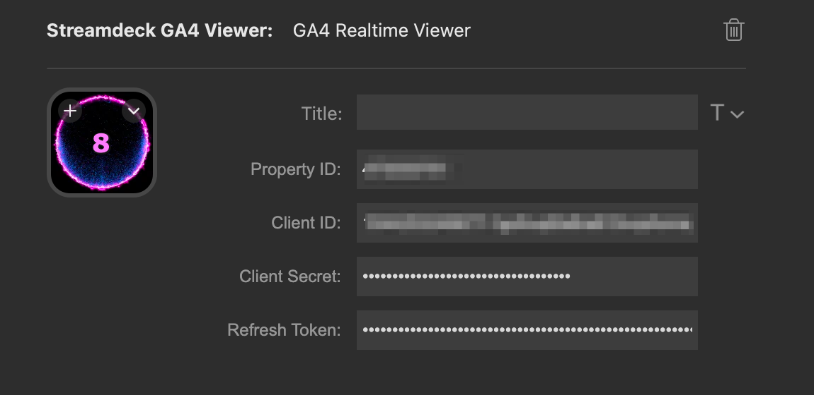

# StreamDeck GA4 Viewer

A Stream Deck plugin that allows you to view Google Analytics 4 (GA4) realtime data directly on your Stream Deck device.  
  


## Features

- **GA4 Realtime Viewer**: Display realtime analytics data from your GA4 property
- **Counter**: Simple counter that increments on press (demo feature)

## Requirements

- Stream Deck SDK
- Node.js v20 or later
- Google Cloud Platform account  
  - Google Analytics Data API enabled
  - Client ID and Client Secret
  - Refresh Token
    - How to get: <https://developers.google.com/google-ads/api/docs/oauth/playground?hl=en>  
    - Note: When you publish in test status, it expires in 1 week
- GA4 property

## Installation

1. Clone this repository
2. Install dependencies:

```bash  
npm install -g @elgato/cli@latest
npm install
```  

1. Build the plugin:

```bash
npm run build
```

## Development

To start development with hot reload:

```bash
npm run watch
```

## Project Structure

- `src/` - TypeScript source files
- `com.yumikokh.streamdeck-ga4-viewer.sdPlugin/` - Plugin resources
  - `ui/` - HTML files for property inspector
  - `imgs/` - Icons and images
  - `manifest.json` - Plugin configuration

## Built With

- [@elgato/streamdeck](https://www.npmjs.com/package/@elgato/streamdeck) - Stream Deck SDK
- TypeScript
- Rollup

## Author

yumikokh

## License

This project is licensed under the MIT License.
